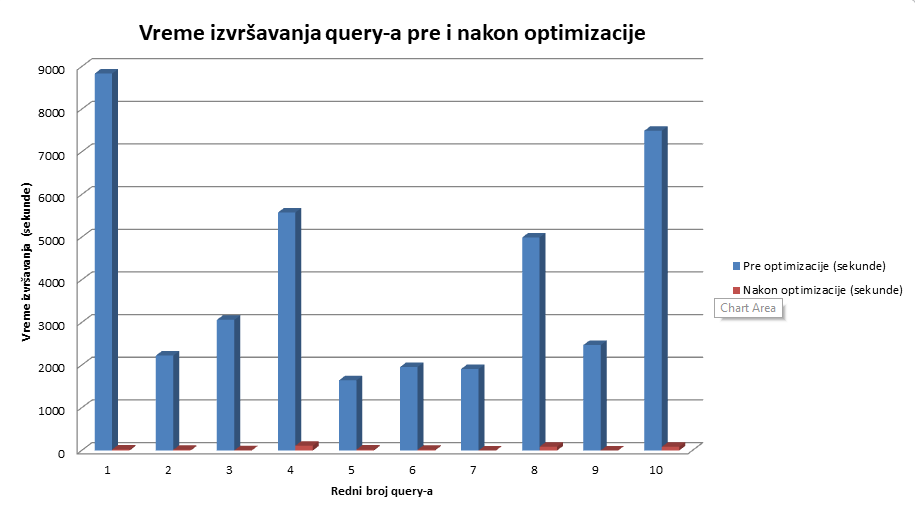

# **Spotify Data Analysis**
Projekat iz predmeta **_Sistemi Baza Podataka_**, koji se bavi analizom podataka o podacima Spotify aplikacije koriscenjem MongoDB NoSQL baze podataka

Autori projekta su [Miljan Lazić](https://github.com/z1cLa) RA212/2020, [Aleksandar Milović](https://github.com/milovicaleksandar001) RA67/2020

### Korišćen je sledeći Data-Set:
###     [](https://www.kaggle.com/datasets/maltegrosse/8-m-spotify-tracks-genre-audio-features)
Više o samom Data-Set-u možete saznati na samom [linku](https://www.kaggle.com/datasets/maltegrosse/8-m-spotify-tracks-genre-audio-features) ili u našoj prezentaciji ```resources/SpotifyDataAnalysis.pdf``` [prezentacija](resources/AnalizaPodatakaSpotify.pdf)

# **Upotreba projekta**

Za početak pokrećemo našu skriptu koja sve podatke iz .SQLite prebacuje u MongoDB bazu podataka, pošto je Data-Set veoma obiman odlučili smo da koristimo podatke koji su noviji od 13.05.2017.

Skripta se nalazi ```scripts/data_migration.py``` i pokreće se komandom u terminalu ```Python data_migration.py``` _(podaci o Data-Setu moraju da se nalaze takodje u scripts folderu)__

## Pokretanje upita
Neoptimizovani upiti čiji je autor Miljan nalaze se u direktorijumu [scripts/Queries/ML/](scripts/Queries/ML/*) i njihovi nazivi su ```NotOptimized#1.js, NotOptimized#2.js...```

Neoptimizovani upiti čiji je autor Aleksandar nalaze se u direktorijumu [scripts/Queries/AM/](scripts/Queries/AM/*) i njihovi nazivi su ```NotOptimized#1.js, NotOptimized#2.js...```

## Optimizacija

Nakon toga radjena je optimizacija šeme baze, više o tome možete saznati u prezentaciji

Optimizacioni upiti nalaze se u direktorijumu ```/optimisations```

Upiti [Tracks_With_Artists](optimisations/#1_TRACKS_WITH_ARTISTS.js), [Tracks_With_Artists_And_Af](optimisations/#2_TRACKS_WITH_ARTISTS_AND_AF.js), [Tracks_Optimized](optimisations/#3_TRACKS_OPTIMIZED.js) rade na optimizaciji svih podataka koji se koriste za upite koji koriste tracks kolekciju, i kao output daje kolekciju **tracks_optimized**

Upit [Artists_With_Genres](optimisations/#4_ARTISTS_WITH_GENRES.js) u kolekciju Artists ubacuje sve zanrove u kojima je artist radio i kao output daje kolekciju **artists_with_genres**

Upit [Albums_With_Tracks](optimisations/#5_ALBUMS_WITH_TRACKS.js) u kolekciju Albums dodaje sve trake sa tog albuma i kao output daje kolekciju **albums_with_tracks**

_**Indeksi** korišćeni za upite optimizacije šeme nalaze se [optimisations/IndexesForOptimisation.js](optimisations/IndexesForOptimisation.js)_

## Pokretanje optimizovanih upita
Optimizovani upiti čiji je autor Miljan nalaze se u direktorijumu [scripts/Queries/ML/](scripts/Queries/ML/*)  i njihovi nazivi su ```Optimized#1.js, Optimized#2.js...```

Optimizovani upiti čiji je autor Aleksandar nalaze se u direktorijumu [scripts/Queries/AM/](scripts/Queries/AM/*) i njihovi nazivi su ```Optimized#1.js, Optimized#2.js...```

_**Indeksi** korišćeni za optimizovane upite nalaze se [scripts/Queries/Indexes.js](scripts/Queries/Indexes.js)_

Nakon optimizacije dobijamo mnogo brže izvršavanje upita što je prikazano na grafiku




